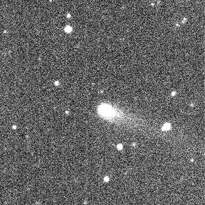

API User's Guide
================

The `SBN Survey Image Service <https://sbnsurveys.astro.umd.edu/api/ui>`_ (SIS)
is deployed and available for `PDS Small-Bodies Node
<https://pds-smallbodies.astro.umd.edu/>`_ survey holdings.  Two data sets are
currently available:

* Near-Earth Asteroid Tracking (NEAT) survey
* Asteroid-Terrestrial Last Alert System (ATLAS) survey

This guide explains how to use the SIS to access these data, whether you already
know the data product you are interested in, or you want to search the database
to inspect it's holdings.

The API specification is defined with OpenAPI, and is available as `Swagger
documentation <https://sbnsurveys.astro.umd.edu/api/ui>`_.

Why search the database?
------------------------

.. note::

    The primary means for accessing SBN's survey holdings is through the `CATCH
    tool <https://catch.astro.umd.edu/>`_.  CATCH can search for known comets,
    asteroids, or fixed (Celestial) targets.

Although most users will use CATCH as the access point for SBN's survey data,
the SIS is appropriate in limited circumstances.  For example, a user may want
to identify data related to CATCH results, or may be curious about the general
state of the data archived and available for a survey.

Summarize by collection and facility
------------------------------------

The ``/summary`` API endpoint returns a list of all data organized by collection
and facility

    https://sbnsurveys.astro.umd.edu/api/summary

.. code:: json
    :force:

    [
        {
            "collection": "test-collection",
            "count": 808,
            "facility": "test-facility",
            "instrument": "test-instrument"
        },
        {
            "collection": "urn:nasa:pds:gbo.ast.atlas.survey.234:58475",
            "count": 1027,
            "facility": "ATLAS MLO 0.5m Telescope",
            "instrument": "STA-1600 10.5x10.5k CCD"
        },
        {
            "collection": "urn:nasa:pds:gbo.ast.atlas.survey.234:58476",
            "count": 134,
            "facility": "ATLAS HKO 0.5m Telescope",
            "instrument": "STA-1600 10.5x10.5k CCD"
        },
        {
            "collection": "urn:nasa:pds:gbo.ast.atlas.survey.234:58476",
            "count": 994,
            "facility": "ATLAS MLO 0.5m Telescope",
            "instrument": "STA-1600 10.5x10.5k CCD"
        },
        ...
    ]

In the above snippet, we see a "test-collection" data set that is used for
internal testing, and the first three ATLAS entries.  The first is the Mauna Loa
telescope data from the ``urn:nasa:pds:gbo.ast.atlas.survey.234:58475`` data
collection.  See the ATLAS documentation for naming schemes.  The next two are
data from another collection (...58476), separated into the Mauna Loa and
Haleakala telescopes.  There are 994 data products from the Mauna Loa telescope
in the ``urn:nasa:pds:gbo.ast.atlas.survey.234:58476`` data collection.

Find data products in a collection
----------------------------------

The ``/query`` endpoint returns products matching the requested criteria.  The
following fields are searchable:

==========  ========================================  ===============================================
Field       Description                               Example
==========  ========================================  ===============================================
collection  PDS4 collection logical identifier (LID)  ``urn:nasa:pds:gbo.ast.atlas.survey.234:58475``
facility    Observing facility (telescope)            ATLAS MLO 0.5m Telescope
instrument  Instrument (camera)                       STA-1600 10.5x10.5k CCD
dptype      Data product type                         image
==========  ========================================  ===============================================

Only exact matches are returned.

To list all data products in the ``urn:nasa:pds:gbo.ast.atlas.survey.234:58475`` collection:

    https://sbnsurveys.astro.umd.edu/api/query?collection=urn:nasa:pds:gbo.ast.atlas.survey.234:58475

.. code:: json
    :force:

    {
        "count": 100,
        "offset": 0,
        "results":
            [
                {
                    "access_url": "https://sbnsurveys.astro.umd.edu/api/images/urn%3Anasa%3Apds%3Agbo.ast.atlas.survey.234%3A58475%3A01a58475o0021o.fits?format=fits",
                    "calibration_level": 1,
                    "collection": "urn:nasa:pds:gbo.ast.atlas.survey.234:58475",
                    "dptype": "image",
                    "facility": "ATLAS MLO 0.5m Telescope",
                    "instrument": "STA-1600 10.5x10.5k CCD",
                    "obs_id": "urn:nasa:pds:gbo.ast.atlas.survey.234:58475:01a58475o0021o.fits",
                    "pixel_scale": 0.000517261699601208,
                    "target": "Sky"
                },
                {
                    "access_url": "https://sbnsurveys.astro.umd.edu/api/images/urn%3Anasa%3Apds%3Agbo.ast.atlas.survey.234%3A58475%3A01a58475o0022o.fits?format=fits",
                    "calibration_level": 1,
                    "collection": "urn:nasa:pds:gbo.ast.atlas.survey.234:58475",
                    "dptype": "image",
                    "facility": "ATLAS MLO 0.5m Telescope",
                    "instrument": "STA-1600 10.5x10.5k CCD",
                    "obs_id": "urn:nasa:pds:gbo.ast.atlas.survey.234:58475:01a58475o0022o.fits",
                    "pixel_scale": 0.000517256588879647,
                    "target": "Sky"
                },
                ...
            ],
        "total": 1027
    }

The first 100 matches are returned.  To return the next 100, set the ``offset`` parameter to 100:

    https://sbnsurveys.astro.umd.edu/api/query?collection=urn:nasa:pds:gbo.ast.atlas.survey.234:58475&offset=100

.. code:: json
    :force:

    {
        "count": 100,
        "offset": 100,
        "results": [ ... ],
        "total": 1027
    }

Get image data
--------------

To get the survey data, use the ``/images/{id}`` endpoint, where ``{id}`` is the
data product's PDS4 logical identifier (the ``obs_id`` field in query results).
Return the image for the LID
``urn:nasa:pds:gbo.ast.atlas.survey.234:58475:01a58475o0021o.fits``:

    https://sbnsurveys.astro.umd.edu/api/images/urn:nasa:pds:gbo.ast.atlas.survey.234:58475:01a58475o0021o.fits?download=true

.. note::

    This will download a 140 MB data file.

    ATLAS data are stored at SBN as compressed FITS files.  The file should be
    saved with the ``.fz`` extension to reflect this fact.

Get an image cutout
-------------------

Return a cutout around a specific location in an image using the
``/images/{id}`` endpoint with the ``ra``, ``dec``, and ``size`` options.  This
example is for the NEAT survey:

    https://sbnsurveys.astro.umd.edu/api/images/urn:nasa:pds:gbo.ast.neat.survey:data_tricam:p20020222_obsdata_20020222120052c?ra=174.62244&dec=17.97594&size=5arcmin

To return a JPEG formatted image, use the ``format=jpeg`` option:

    https://sbnsurveys.astro.umd.edu/api/images/urn:nasa:pds:gbo.ast.neat.survey:data_tricam:p20020222_obsdata_20020222120052c?ra=174.62244&dec=17.97594&size=5arcmin

Image metadata
--------------

FITS formatted image cutouts carry the original FITS header, unmodified except for WCS keywords.  Image previews (JPEG, PNG) will contain a limited amount of WCS metadata based on the `Astronomy Visualization Metadata Standard <https://www.virtualastronomy.org/avm_metadata.php>`_.  The metadata are stored in the image file's Extensible Metadata Platform (XMP) tags, and may be used to, e.g., `overlay images in the Worldwide Telescope <https://docs.worldwidetelescope.org/layer-guide/1/astro-image-data/>`_.

Archival metadata: PDS4 labels
------------------------------

Return the archival metadata associated with a data product using the
``images/{id}`` endpoint with the ``format=label`` option:

    https://sbnsurveys.astro.umd.edu/api/images/urn:nasa:pds:gbo.ast.atlas.survey.234:58475:01a58475o0021o.fits?format=label

.. code:: xml

    <?xml version="1.0" encoding="utf-8"?>

    <?xml-model href="https://pds.nasa.gov/pds4/pds/v1/PDS4_PDS_1L00.sch"
        schematypens="http://purl.oclc.org/dsdl/schematron"?>
    <?xml-model href="https://pds.nasa.gov/pds4/disp/v1/PDS4_DISP_1L00_1510.sch"
        schematypens="http://purl.oclc.org/dsdl/schematron"?>
    <?xml-model href="https://pds.nasa.gov/pds4/img/v1/PDS4_IMG_1L00_1890.sch"
        schematypens="http://purl.oclc.org/dsdl/schematron"?>
    <?xml-model href="https://pds.nasa.gov/pds4/survey/v1/PDS4_SURVEY_1L00_1100.sch"
        schematypens="http://purl.oclc.org/dsdl/schematron"?>
    <?xml-model href="https://pds.nasa.gov/pds4/ebt/v1/PDS4_EBT_1L00_1100.sch"
        schematypens="http://purl.oclc.org/dsdl/schematron"?>

    <Product_Observational xmlns="http://pds.nasa.gov/pds4/pds/v1" 
        xmlns:disp="http://pds.nasa.gov/pds4/disp/v1" 
        xmlns:ebt="http://pds.nasa.gov/pds4/ebt/v1" 
        xmlns:img="http://pds.nasa.gov/pds4/img/v1" 
        xmlns:survey="http://pds.nasa.gov/pds4/survey/v1" 
        xmlns:xsi="http://www.w3.org/2001/XMLSchema-instance" 
        xsi:schemaLocation="http://pds.nasa.gov/pds4/pds/v1 http://pds.nasa.gov/pds4/pds/v1/PDS4_PDS_1L00.xsd  http://pds.nasa.gov/pds4/disp/v1 https://pds.nasa.gov/pds4/disp/v1/PDS4_DISP_1L00_1510.xsd  http://pds.nasa.gov/pds4/img/v1 https://pds.nasa.gov/pds4/img/v1/PDS4_IMG_1L00_1890.xsd   http://pds.nasa.gov/pds4/survey/v1   https://pds.nasa.gov/pds4/survey/v1/PDS4_SURVEY_1L00_1100.xsd  http://pds.nasa.gov/pds4/ebt/v1   https://pds.nasa.gov/pds4/ebt/v1/PDS4_EBT_1L00_1100.xsd">
        <Identification_Area>
            <logical_identifier>urn:nasa:pds:gbo.ast.atlas.survey.234:58475:01a58475o0021o.fits</logical_identifier>
            <version_id>1.0</version_id>
            <title>ATLAS reduced image 01a58475o0021o</title>
            ...
        </Identification_Area>
        ...
    </Product_Observational>
