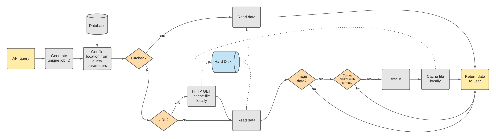

.. SBN Survey Image Service documentation master file, created by
   sphinx-quickstart on Thu Aug 29 09:53:40 2024.
   You can adapt this file completely to your liking, but it should at least
   contain the root `toctree` directive.

SBN Survey Image Service
========================

The SBN Survey Image Service (SIS) is a REST API that enables a user to retrieve
archive images and cutouts thereof from the NASA Planetary Data System's
Small-Bodies Node (PDS SBN). The returned data may be in FITS, JPEG, or PNG
formats. The service can also return the image's PDS label.

The `SBN Survey Image Service <https://sbnsurveys.astro.umd.edu/api/ui>`_ (SIS)
is deployed and available for `PDS Small-Bodies Node
<https://pds-smallbodies.astro.umd.edu/>`_ survey holdings.  See the
:doc:`api-guide` or the `API documentation
<https://sbnsurveys.astro.umd.edu/api/ui>`_ for details.

.. note::

   This service is more closely aligned with IVOA concepts, rather than PDS4
   concepts.  This may be changed in the future. PDS4-concept supported queries
   are possible with the `PDS4 Registry <https://pds.mcp.nasa.gov/api/search/>`_.

.. toctree::
   :maxdepth: 2
   :caption: Contents:

   api-guide
   install
   adding-data
   service
   development

