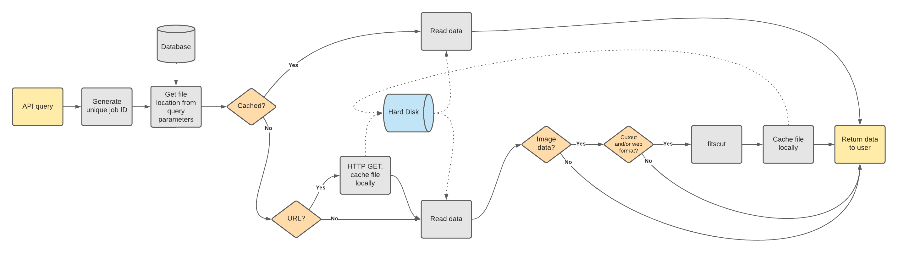

# SBN Survey Image Service (Working Draft) v0.3.0-dev0

## Deployed Openapi Interface

Live at the PDS [Small Bodies Node](https://sbnsurveys.astro.umd.edu/api/ui)

## What's This?

The SBN Survey Image Service is a REST API that enables a user to retrieve archive images and cutouts thereof from the Planetary Data System's Small-Bodies Node (PDS SBN).  For example, a user may request a full-frame image from the ATLAS survey archive, or a small cutout around their object of interest.  The returned data may be in FITS, JPEG, or PNG formats.  The service can also return the image's PDS label.



## Code Features

- Uses [fitscut](https://github.com/spacetelescope/fitscut) for image cutouts and JPEG/PNG generation
- Flask API layer
- Connexion used to generate swagger interface
- Gunicorn/Apache used for production deployment
- Backed by Postgresql or Sqlite3

## Development

- [ ] resolve image locations using the PSD registry
- [ ] deploy as an AWS Lambda service?

## Requirements

- Python (with pip and venv) v3.8+
- gcc
- [libtool](https://www.gnu.org/software/libtool/)

## Installation and Operations

This repo has code for:

- Running a flask-connexion API
- Testing

The code base is operated using bash scripts that begin with the `_` underscore character.  Most day-to-day tasks can be accomplished with the `_sbnsis` command.

The following steps are needed to set up the code base:

- Clone the repo locally:

  ```
      git clone https://github.com/Small-Bodies-Node/sbn-survey-image-service
      cd sbn-survey-image-service
  ```

- Create a new environment variable file and edit to suit your needs: `_sbnsis env`.
- Initialize your installation with `source _initial_setup.sh`. This will:
  - Create and activate a python virtual environment.
  - Install dependencies (e.g., `fitscut`) to the virtual env, if needed.
  - Make the variables in `.env` available to your shell.
- Optionally test your set up: `bash _tests`
- Run in deployment or development modes (see below for details):
  - Deployment: `_sbnsis start`
  - Development:
    - With `nodemon` installed: `_sbnsis start --dev`
    - Otherwise: `python -m sbn_survey_image_service.api.app`

## API documentation

Whether running in development or deployment modes, the Swagger documentation is available at `http://localhost:API_PORT/ui`, where `API_PORT` is defined in your `.env`.

## Deployment notes

The `_sbnsis` script takes the arguments `start|stop|status|restart` to launch the app as a background process with the Gunicorn WSGI server for production serving. The number of workers is controlled with the env variable `LIVE_GUNICORN_INSTANCES`. If you have trouble getting Gunicorn to work, running in non-daemon mode may help with debugging: `_sbnsis start --no-daemon`.

It is recommended that you make the gunicorn-powered server accessible to the outside world by proxy-passing requests through an HTTPS-enabled web server like Apache.

## Development notes

SBNSIS translates PDS4 logical identifiers to file locations using the PDS4 Registry.  However, the registry's file locations are all remote URLs.  Furthermore, the registry query only returns the PDS4 label URL.  The URL may need to be edited to point to a local file, depending on where SBNSIS is deployed (specified via an environment variable).  To enable or edit support for a new survey or deployment location, see `sbn_survey_image_service/data/locate.py`.

It is assumed that survey images are FITS-compatible with a World Coordinate System defined for a standard sky reference frame (ICRS).  The cutout service uses the FITS header, not the PDS labels, to define the sub-frame.  This is a limitation from using `fitscut`.

## Logging

Application error and informational logging is sent to the standard error stream (stderr) and the file specified by the `SBNSIS_LOG_FILE` environment variable.

Successful requests will produce two log items: the parameters and the results as JSON-formatted strings.  The items are linked by a randomly generated job ID:

```
INFO 2021-02-17 14:10:16,960: {"job_id": "013f7515aa074ee58ad5929c8391a366", "id": "urn:nasa:pds:gbo.ast.neat.survey:data_tricam:p20021023_obsdata_20021023113833a", "ra": 47.4495603, "dec": 32.9424075, "size": "5arcmin", "format": "fits", "download": true}
INFO 2021-02-17 14:10:18,339: {"job_id": "013f7515aa074ee58ad5929c8391a366", "filename": "/hylonome3/transient/tmpw8s8qj1b.fits", "download_filename": "20021023113833a.fit_47.4495632.94241_5arcmin.fits", "mime_type": "image/fits"}
```

OpenAPI errors (e.g., invalid parameter values from the user) are not logged.  Internal code errors will be logged with a code traceback.
